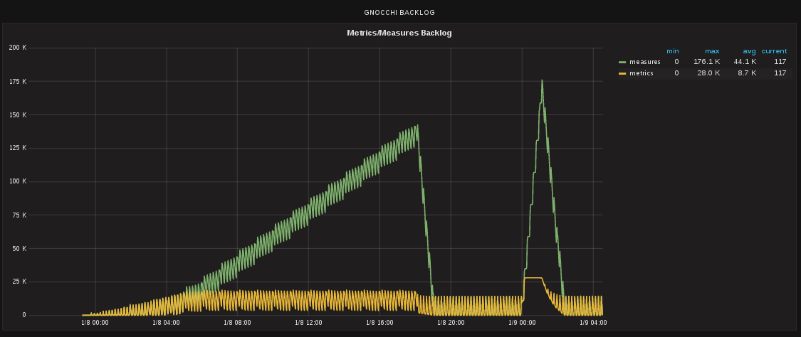

Gnocchi Status Collectd
=======================

## Overview

This plugin provides valuable insight into your metrics and measures backlog of Gnocchi when installed in an OpenStack environment.  It will cost an api call to Gnocchi status api every $interval (set in the collectd config file per the plugin). Gnocchi is an OpenStack Telemetry project for Metric-as-a-Service.

## Sample Graph



## Configuration

1. Assuming you have collectd installed already, append the following plugin details to your collectd.conf config file

        ```
        <LoadPlugin python>
          Globals true
        </LoadPlugin>

        <Plugin python>
          ModulePath "/usr/local/bin/"
          LogTraces true
          Interactive false
          Import "collectd_gnocchi_status"
          <Module collectd_gnocchi_status>
            interval 30
          </Module>
        </Plugin>
        ```
2. Setup your environment variables in the collectd systemd unit file

        ```
        # Populate the following variables with your stackrc/overcloudrc or openstackrc file
        Environment=OS_TENANT_NAME=admin
        Environment=OS_PASSWORD=xxxxxxxxxxxxxxxxxxxxxxxxx
        Environment=OS_USERNAME=admin
        Environment=OS_AUTH_URL=http://x.x.x.x:5000/v2.0
        Environment=OS_CLOUDNAME=overcloud
        Environment=OS_NO_CACHE=True
        # End Environment variables to configure
        ```
3. Copy plugin into `/usr/local/bin/`

        ```
        [root@overcloud-controller-0 ~]# cd /usr/local/bin/
        [root@overcloud-controller-0 bin]# curl https://raw.githubusercontent.com/akrzos/gnocchi-status-collectd/master/collectd_gnocchi_status.py -o collectd_gnocchi_status.py
          % Total    % Received % Xferd  Average Speed   Time    Time     Time  Current
                                         Dload  Upload   Total   Spent    Left  Speed
        100  1900  100  1900    0     0   4548      0 --:--:-- --:--:-- --:--:--  4545
        [root@overcloud-controller-0 ~]#
        ```
4. Reload Systemd units

    ```
    [root@overcloud-controller-0 ~]# systemctl daemon-reload
    ```
5. Restart collectd

    ```
    [root@overcloud-controller-0 ~]# systemctl restart collectd
    ```
6. View metrics in your metrics on Gnocchi in your TSDB

## Resources
1. [Gnocchi.xyz](http://gnocchi.xyz/)
2. [Collectd.org](https://collectd.org/)
